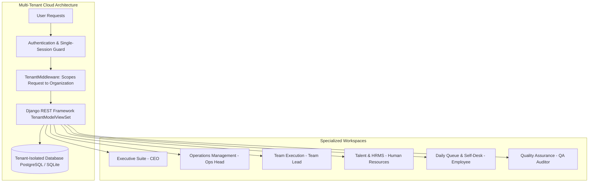
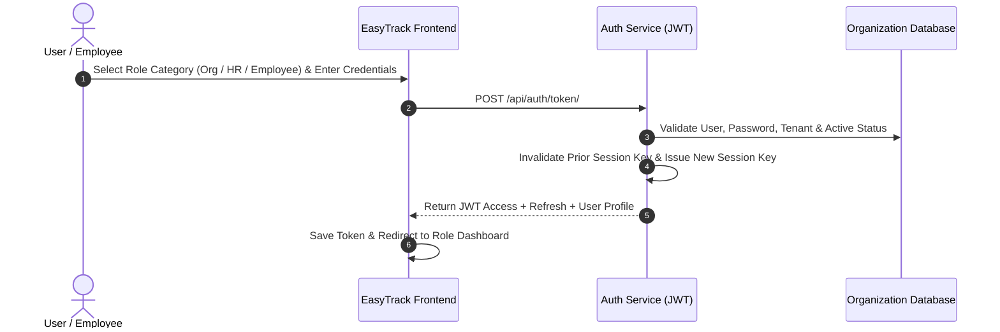
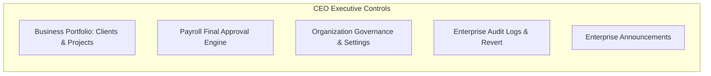
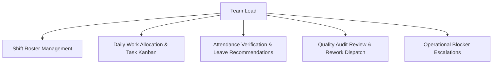
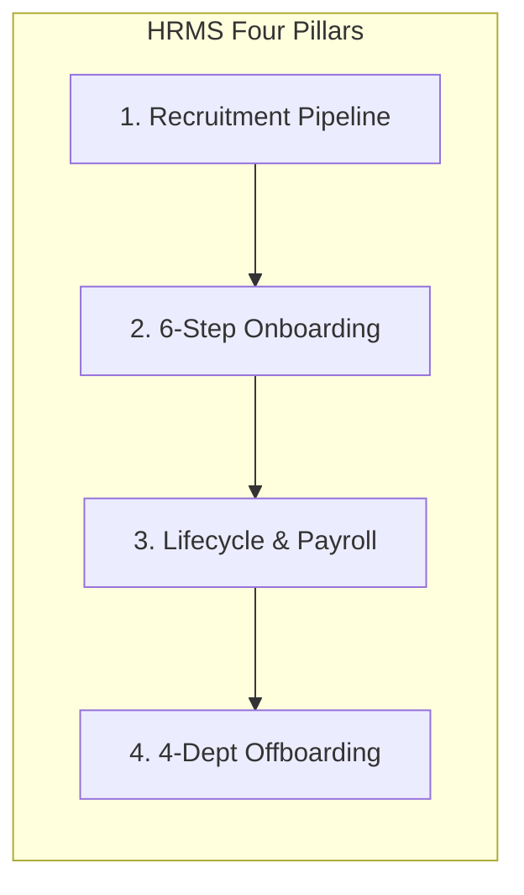
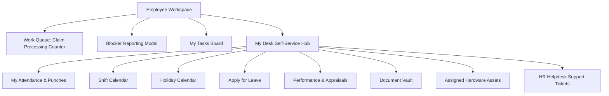
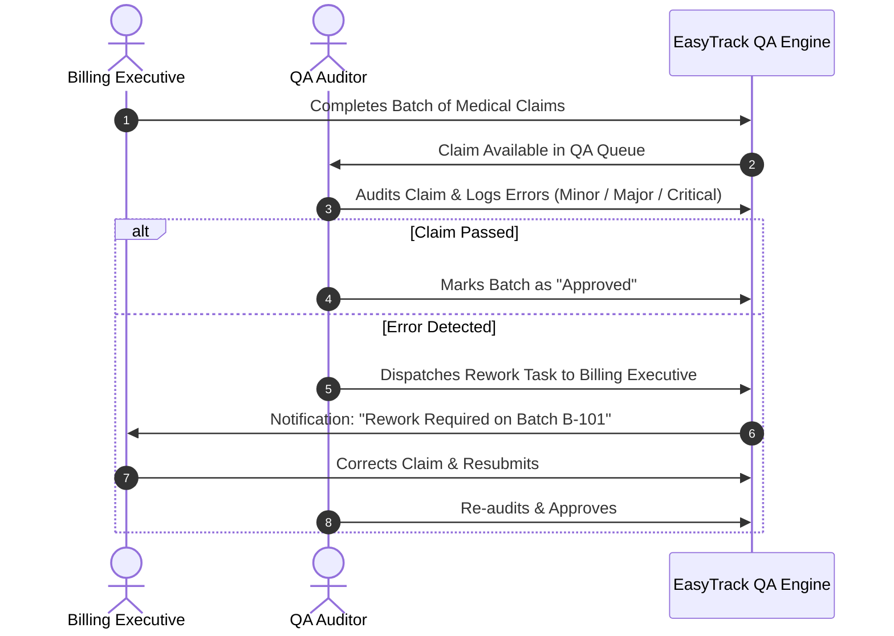
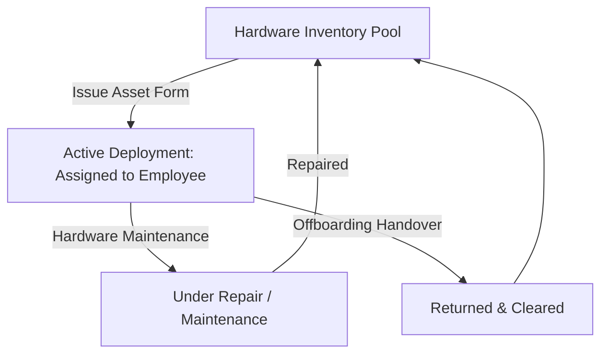

# EasyTrack: Complete Platform User Manual & Administrator Guide
**Medical Billing Workforce & Operations Management SaaS Platform**
*Version: 2.0 Enterprise | Document Revision: September 2026*

---

## 📑 Table of Contents
1. [Platform Overview & Core Architecture](#1-platform-overview--core-architecture)
2. [User Roles & RBAC Permission Matrix](#2-user-roles--rbac-permission-matrix)
3. [Authentication, Onboarding & Account Management](#3-authentication-onboarding--account-management)
4. [Global UI Layout & Universal Controls](#4-global-ui-layout--universal-controls)
5. [Executive Suite: CEO Portal](#5-executive-suite-ceo-portal)
6. [Operations Head Workspace](#6-operations-head-workspace)
7. [Team Lead (TL) Portal](#7-team-lead-tl-portal)
8. [Human Resources (HR) Management Suite](#8-human-resources-hr-management-suite)
9. [Employee Self-Service & Daily Operations](#9-employee-self-service--daily-operations)
10. [Quality Assurance (QA) System](#10-quality-assurance-qa-system)
11. [Communication Hub & Announcements](#11-communication-hub--announcements)
12. [Hardware Asset Management & Inventory](#12-hardware-asset-management--inventory)
13. [Governance, Audit Logs & System Settings](#13-governance-audit-logs--system-settings)
14. [Step-by-Step Standard Operating Walkthroughs](#14-step-by-step-standard-operating-walkthroughs)
15. [Troubleshooting, Security & FAQ](#15-troubleshooting-security--faq)

---

# 1. Platform Overview & Core Architecture

### What is EasyTrack?
**EasyTrack** is an enterprise Multi-Tenant Software-as-a-Service (SaaS) application purposefully engineered for **Medical Billing Workforce & Operations Management**. It bridges the gap between workforce lifecycle administration (HRMS), daily operational billing batch execution, client service-level agreement (SLA) monitoring, quality assurance auditing, and financial payroll disbursement.



### Core Architectural Foundations
1. **Multi-Tenancy & Absolute Data Isolation**:
   - Every company/tenant functions within its own isolated organizational perimeter.
   - All backend database models inherit from `TenantModel`, which automatically tags each record with `organization`, `created_at`, `updated_at`, `created_by`, and `updated_by`.
   - Data isolation is enforced strictly at the database query level via `TenantModelViewSet.get_queryset()`. Even if an actor guesses or manipulates a primary key ID belonging to another company, the query returns `404 Not Found`.
2. **Single Active Device Session Security**:
   - To protect confidential Protected Health Information (PHI) and medical billing records, EasyTrack enforces **Single Active Session Enforcement**.
   - When a user logs in, a unique `session_key` is registered in JWT token claims. If the same user credentials are used to log in from another browser or device, the previous session is immediately invalidated with a **"Session Superseded"** alert.
3. **Privacy-First Messaging Infrastructure**:
   - Private 1-on-1 and group chat conversations are visible **only** to direct participants.
   - Company executives (CEOs, HR Managers, TLs) cannot inspect private chats that they are not a member of.
   - Central audit logs record only message dispatch metadata (e.g., actor name, timestamp, conversation ID) and **never** record actual message content.
4. **Dual Database Engine Resilience**:
   - Production environments leverage PostgreSQL for enterprise concurrency and ACID compliance.
   - For rapid local development and demo portability, EasyTrack falls back automatically to SQLite if PostgreSQL environment variables are omitted.
5. **Role-Based Access Control (RBAC)**:
   - Six distinct roles are baked into the core system, each providing access to dedicated portals, action permissions, and telemetry dashboards.

---

# 2. User Roles & RBAC Permission Matrix

EasyTrack enforces six primary user roles. Below is an overview of responsibilities and permissions:

### 1. 💼 Chief Executive Officer (CEO)
- **Scope**: Highest-level business, financial, and organizational authority.
- **Key Responsibilities**:
  - Monitors high-level business analytics, operational margins, client health, and workforce productivity.
  - Final approval of monthly payroll cycles and custom compensation/incentive policies.
  - Organization-wide access control, role permissions configuration, and system governance.
  - Publishes enterprise announcements and reviews tamper-evident audit logs.

### 2. ⚙️ Operations Head
- **Scope**: Operational throughput, client portfolio management, process definitions, and delivery SLAs.
- **Key Responsibilities**:
  - Full management of client accounts, onboarding new clients, and setting contract targets.
  - Creates Process Definitions and Standard Operating Procedures (SOPs).
  - Assigns work batches to Team Leads and monitors claim resolution rates.
  - Investigates blockers (system outages, missing demographics) and resolves client escalations.
  - Access to operational dashboards, workforce roster schedules, and quality trend curves.

### 3. 👥 Team Lead (TL)
- **Scope**: Direct team execution, roster management, daily claim queues, and quality coaching.
- **Key Responsibilities**:
  - Manages workforce shift rosters (Day, Evening, Night shifts, grace times).
  - Distributes daily billing tasks to employees and monitors claim progress.
  - Reviews daily team attendance punches and recommends leave approval/rejection.
  - Handles operational escalations and dispatches rework flagged by the QA department.

### 4. 🤝 Human Resources (HR)
- **Scope**: Talent acquisition, onboarding, employee lifecycle, attendance, leaves, hardware assets, and payroll.
- **Key Responsibilities**:
  - Manages recruitment job openings, applicant pipelines, and candidate selection.
  - Coordinates 6-step employee onboarding clearance, statutory compliance, and document vaults.
  - Oversees daily attendance logs, shift policies, and leave approvals.
  - Dispatches hardware inventory (laptops, chargers, accessories) and logs serial asset tags.
  - Executes the monthly payroll engine: calculates allowances, deductions, incentives, locks cycles, and exports bank disbursement CSVs.
  - Resolves employee HR Helpdesk support tickets and coordinates 4-department exit clearance.

### 5. 💻 Employee (Medical Billing Executive / Coder / AR Caller)
- **Scope**: Production execution, claim processing, and self-service administration.
- **Key Responsibilities**:
  - Processes claims in assigned work queues using real-time batch counters.
  - Reports operational blockers (e.g., "Portal Down", "Missing Demographics") with priority alerts.
  - Operates the top-bar Attendance Widget: Check-In, Take Break, Resume, Check-Out.
  - Uses the **My Desk** portal: personal attendance, shift schedule, holiday calendar, leave applications, appraisal goals, document vault, assigned assets, and helpdesk tickets.
  - Executes rework on claims returned by the QA team.

### 6. 🔍 QA Auditor (Dynamic Role: `qa_enabled = True`)
- **Scope**: Quality compliance, claim verification, error logging, and audit tracking.
- **Key Responsibilities**:
  - Dedicated access to the **QA Workspace**.
  - Samples completed billing batches and checks claims against medical billing compliance checklists.
  - Classifies error categories (Coding error, Demographics, Denial mismatch) and severity levels (Minor, Major, Critical).
  - Dispatches rework tasks directly back to the responsible billing executive.

---

### Master Granular Permissions Matrix

The table below outlines the default system access capabilities across each functional module:

| Functional Module | CEO | Operations Head | Team Lead (TL) | Human Resources (HR) | Employee | QA Auditor |
|---|:---:|:---:|:---:|:---:|:---:|:---:|
| **Executive Dashboard** | View / Export | — | — | — | — | — |
| **Operations Dashboard** | View / Export | View / Manage | — | — | — | — |
| **Team Dashboard** | View / Export | View | View / Manage | — | — | — |
| **HR Dashboard** | View / Export | — | — | View / Manage | — | — |
| **Employee Dashboard** | View | View | View | View | View / Execute | View |
| **Workforce & Access Control** | Full Control | View / Provision | View (Team Only) | Full Control | — | — |
| **Recruitment Pipeline** | View / Approve | — | — | Full Control | View Openings | — |
| **6-Step Onboarding Clearance** | View | — | — | Full Control | Self-Service | — |
| **Offboarding Clearance** | View | — | Clear (Ops) | Full Control | View Status | — |
| **Client Portfolio** | Full Control | Full Control | View Assigned | — | — | — |
| **Process Definitions & SOPs** | View | Full Control | View / SOP | — | Read SOP | Read SOP |
| **Project Milestones** | Full Control | Full Control | View Assigned | — | — | — |
| **Work Queue & Claim Counter** | View | Full Control | Assign / Monitor | — | Execute Counter | — |
| **Blocker Reporting & Fixes** | View | Resolve | Review / Escalate | — | Report Blocker | — |
| **Daily Tasks Kanban** | View | View / Assign | Full Control | — | Execute Tasks | — |
| **Attendance & Punch Timer** | View All | View All | Review Team | Full Control | Punch & View Self | Punch & View Self |
| **Leave Management** | View All | View All | Recommend | Approve / Reject | Apply & Track | Apply & Track |
| **Shift Rostering & Calendar** | View | Manage | Manage Team | Configure Rules | View Shift | View Shift |
| **Overtime (OT) Engine** | View / Approve | View | View Team | Approve / Reject | View Self | View Self |
| **Payroll Processing** | Final Approve | — | — | Process & Lock | View Payslip | View Payslip |
| **Hardware Asset Inventory** | View | View | — | Full Control | View Assigned | View Assigned |
| **HR Helpdesk Tickets** | — | — | — | Resolve / Assign | Submit Ticket | Submit Ticket |
| **QA Workspace & Audits** | View | View Trends | View Team QA | — | Rework Claims | Full Audit |
| **Private Chat Messaging** | Participant | Participant | Participant | Participant | Participant | Participant |
| **Announcements Board** | Publish / View | Read | Read | Publish / View | Read | Read |
| **Audit Logs & Action Revert** | Full Control | — | — | — | — | — |
| **Organization Settings** | Full Control | View | — | View | — | — |

---

# 3. Authentication, Onboarding & Account Management

EasyTrack features a robust authentication pipeline with support for multi-organization registration, multi-category login, one-time passwords (OTP), and single-active-device session guards.



### 3.1 New Organization (CEO) Registration Wizard
Accessible at `/register`. This 3-step wizard allows a new organization to onboard onto the platform:
1. **Step 1: Account Credentials**:
   - **First Name & Last Name**: Personal executive details.
   - **Username**: Must be unique across the tenant registry (checked via live validation endpoint `/api/auth/check-username/`).
   - **Email Address**: Corporate email address.
   - **Password & Confirm Password**: Enforces strong password criteria with show/hide password toggle.
2. **Step 2: Organization Profile**:
   - **Organization Name**: The unique corporate entity name (checked via `/api/auth/check-org/`).
   - **Industry**: Pre-configured to `Healthcare` (editable).
   - **Country**: Defaults to `India` (supports international healthcare operations).
   - **Timezone**: Defaults to `Asia/Kolkata` (supports multi-region timezones).
   - **Currency**: Defaults to `INR` (`₹`), supports `USD` (`$`), `EUR` (`€`), `GBP` (`£`).
3. **Step 3: Setup Defaults**:
   - **Standard Working Days**: Select operating days (Monday through Saturday checkboxes).
   - **Initial Departments**: e.g., Claims Processing, AR Calling, Denial Management, Human Resources, QA.
   - **Designations**: Pre-populates job roles for the talent pipeline.
   - Clicking **Complete Registration** provisions the organization, creates the CEO user, creates the associated employee profile, generates initial JWT tokens, and redirects immediately to the Executive Suite.

### 3.2 Role-Based Login Portal
Accessible at `/login`. Features category toggles to streamline sign-in:
- **Top Category Switcher**:
  - **Organisation Tab**: Further splits into three sub-roles: **CEO**, **Operations Head**, and **Team Lead (TL)**.
  - **HR Tab**: Streamlined login for Human Resources personnel.
  - **Employee Tab**: Streamlined login for Billing Executives, Medical Coders, and Specialists.
- **Show/Hide Password**: Eye toggle icon on password input.
- **Session Superseded Detection**: If the query parameter `?session_superseded=true` is detected, a warning banner appears: *"Your session was terminated because this account was logged into from another device or browser."*
- **Forgot Password Workflow**:
  - Click **"Forgot Password?"** to launch the recovery modal.
  - Enter the registered corporate email address.
  - The backend validates the email, generates a secure temporary One-Time Password (OTP) (e.g. `PASS-938210`), and sets `must_change_password = True`.
  - A copy button allows the user to immediately copy their credentials to the clipboard.
- **Mandatory Password Change**:
  - When an employee logs in with a temporary OTP or when `must_change_password = True` is set by an administrator, the platform redirects to `/change-password`.
  - The user must provide the old temporary password and confirm a new strong password before accessing system modules.

### 3.3 Access Control & "Give Access" Modal
Admins, Operations Heads, and HR Managers can provision credentials for new or existing staff directly through the **Workforce & Access** page (`/employees`):
- Click **"Give Login Access"** on any employee record.
- **Form Options**:
  - Target Role: Select `employee`, `tl`, `hr`, or `operations_head`.
  - Username: Auto-suggested based on employee name/ID or customizable.
  - Temporary Password: Automatically generates a 6-digit OTP (e.g. `OTP-492019`).
  - Email: Corporate notification target.
- Clicking **Grant Access** creates the user record, associates it with the tenant organization, links the employee profile, and logs the administrative action in the Audit Log.

---

# 4. Global UI Layout & Universal Controls

The EasyTrack layout provides a cohesive, responsive experience across desktop, tablet, and mobile displays.

```
+---------------------------------------------------------------------------------------------------------+
| [=] EASYTRACK LOGO | [Global Search: Staff, Tasks...] | [Date Filter: 22/09/2026] | [Timer] [🔔] [👤 Profile] |
+--------------------+---------------------------------------------------------------+--------------------+
|  SIDEBAR           |                                                                                    |
|  - Dashboard       |  MAIN CONTENT BREADCRUMB / VIEWPORT                                                |
|  - My Desk         |                                                                                    |
|  - Portfolio       |  [Dynamic Page Content Based on Selected Route & Role]                             |
|  - Workforce       |                                                                                    |
|  - Payroll         |                                                                                    |
|  - Communication   |                                                                                    |
|  - Governance      |                                                                                    |
|  [<< Collapse]     |                                                                                    |
+--------------------+------------------------------------------------------------------------------------+
```

### 4.1 Top Application Header
1. **Sidebar Minimizer**: Hamburger button `[=]` toggles the sidebar between expanded (240px) and compact icon-only (68px) modes. Mobile view opens a slide-out drawer with backdrop blur.
2. **Global Staff Search**:
   - Omnibar with search icon. Typing searches across Employee ID, Full Name, Username, Corporate Email, Department, Designation, and Role.
   - Displays real-time matching suggestions with quick links to view profiles or send direct messages.
3. **Global Date Filter**:
   - Displays the active date (defaults to today's date in `DD/MM/YYYY` format).
   - Clicking the calendar opens an inline date picker.
   - Selecting a date automatically synchronizes attendance logs, daily billing metrics, and dashboard telemetry across the application without reloading the page.
4. **Employee Attendance Widget (Header State Machine)**:
   - For employees, the header features a live status indicator and action button:
     - **Not Checked In**: Green button `[ Check In ]`.
     - **Working**: Amber button `[ Take Break ]` and Red button `[ Check Out ]`.
     - **On Break**: Blue button `[ Resume Work ]`.
     - **Checked Out**: Displays status badge *"Checked Out - Day Complete"*.
   - Displays a live running counter of hours and minutes worked today.
5. **Universal Sound & Mute Toggle**:
   - Speaker icon toggles sound effects on/off.
   - When enabled, distinct audio chimes trigger when new chat messages or enterprise announcements arrive.
   - State persists in browser `localStorage`.
6. **Notification Bell Dropdown**:
   - Displays unread notification count in a badge.
   - Click to open the notification slide-down panel showing critical alerts, SLA warnings, leave approvals, and system events.
   - Click any notification to mark it as read or click *"Mark all as read"*.
7. **Profile Dropdown Menu**:
   - Shows user avatar, full name, and role badge.
   - Options include:
     - **My Profile**: View full onboarding summary and documentation.
     - **Account Settings**: Update First Name, Last Name, and Email.
     - **Change Password**: Update login password.
     - **Theme & Appearance**: Opens brand color palette selector.
     - **Logout**: Clears JWT tokens, registers a `LOGOUT` audit log, and redirects to `/login`.

### 4.2 Sidebar & Theme Customization
- **Grouped Navigation**: Navigation links are grouped cleanly by operational domain (e.g., Executive Suite, Enterprise Portfolio, Operations & Metrics, Self-Service & Desk, Governance & Audit).
- **Theme Palette Customizer**:
  - Toggle between **Light Mode** and **Dark Mode**.
  - Choose from 6 accent color schemes:
    1. **Sage** (Teal / Emerald - Default balanced operational theme).
    2. **Rose** (Warm Rose - Default theme for HRMS).
    3. **Lavender** (Purple / Violet - High contrast theme).
    4. **Peach** (Warm Amber - Daytime readability).
    5. **Sky** (Vibrant Azure - Operations focus).
    6. **Indigo** (Royal Indigo - Default executive theme for CEO).

---

# 5. Executive Suite: CEO Portal

The CEO portal (`/ceo-dashboard`) provides high-level business oversight, financial health indicators, and governance controls.



### 5.1 Executive Dashboard Telemetry Cards
1. **Total Headcount**: Non-CEO active staff across all departments. Displays breakdown of active vs inactive members.
2. **Today's Attendance Rate**: Live calculation for the selected date. Shows total present, absent, on leave, and percentage adherence.
3. **Monthly Base Payroll**: Aggregates base salaries of all active personnel.
4. **Target Incentives Calculated**: Real-time aggregation of performance bonuses earned based on claim processing exceeding 100% and 120% of target quotas.
5. **Active Client Projects**: Count of active medical billing client contracts currently in execution.
6. **Operational Margin Health**: Graphical visualizer charting billing output volume against operational labor expense.

### 5.2 Enterprise Portfolio Hub (`/portfolio`)
- **Clients Tab**: View all contracted medical practices and hospital networks, assigned Operations Heads, Team Leads, and SLA health indicators.
- **Projects Tab**: Track project milestones, active billable codes, target deliverables, and team assignments.
- **Financial Tab**: High-level review of billing revenue projections vs monthly workforce payroll burn rate.

### 5.3 Governance & Roles Matrix (`/roles-permissions`)
- Allows the CEO to inspect and adjust permissions across all 19 functional modules for each role.
- Toggles specific capabilities: `View`, `Create`, `Edit`, `Delete`, `Approve`, and `Export`.
- Click **"Save Permissions Matrix"** to persist security rules.

---

# 6. Operations Head Workspace

The Operations Head portal (`/operations-dashboard`) manages client delivery, billing workflows, SLA monitoring, and operational queues.

### 6.1 Operations Dashboard Tabs
1. **Dashboard Tab**:
   - Displays KPIs: Open Batches, Overall Completion Percentage, Average Claim Turnaround Time (TAT), and Active Blockers.
   - Interactive charts: Claim processing volumes by date, process distribution (e.g. Verification, Coding, AR Follow-up).
2. **Clients Tab (`/clients`)**:
   - **Add Client Modal**:
     - Client Code (e.g. `CLI-ALPHA`), Client Name, Contact Email.
     - Assigned Operations Head & Assigned Team Lead dropdowns.
     - Status: `Active` or `Onboarding`.
   - **Edit Client**: Update contract terms, modify assigned leadership, or toggle client status.
   - **Direct Contact Button**: Generates a pre-formatted operational check-in email to the client team.
3. **Processes & SOPs Tab (`/processes`)**:
   - Define medical billing processes (e.g. Prior Authorization, Charge Entry, Payment Posting, Denial Resolution).
   - Configure **Daily Quota Targets** (e.g. 50 claims/day).
   - Formatted Standard Operating Procedure (SOP) text editor: Document payer-specific rules (e.g., Medicare, BlueCross, Aetna), ICD-10 coding nuances, and denial codes.
4. **Projects Tab (`/projects`)**:
   - Create and track project deliverables, timelines, milestone statuses, and linked client accounts.
5. **Work Queues & Batch Allocation (`/billing`)**:
   - Create new claim batches: Select Client, Process, Assigned TL, Assigned Employee, Work Type, Target Quantity, Priority (`Low`, `Medium`, `High`, `Critical`), and Due Date.
   - Monitor real-time claim completion progress bars.
6. **Escalations & SLA Monitoring (`/escalations`)**:
   - View flagged escalations from clients or Team Leads.
   - Review escalation severity, creation timestamp, and assigned owner.
   - Mark escalations as `In Progress` or `Resolved`.
7. **Workflow Automation (`/automation`)**:
   - View automated SLA escalation rules and batch allocation triggers.

---

# 7. Team Lead (TL) Portal

The Team Lead portal (`/tl-dashboard`) manages shift coordination, task assignments, and day-to-day team productivity.



### 7.1 Team Management & Shift Rostering (`/scheduling`)
- **Shift Templates**:
  - **Day Shift**: 08:00 AM – 05:00 PM (15-min grace period, OT after 9 hrs).
  - **Evening Shift**: 02:00 PM – 11:00 PM (15-min grace period, OT after 9 hrs).
  - **Night Shift**: 10:00 PM – 07:00 AM (20-min grace period, OT after 8 hrs).
- **Roster Allocation**: Assign shifts to individual employees for weekly or monthly rotations.
- **Roster Synchronization**: Updates are reflected on employee shift calendars and attendance punch verification engines.

### 7.2 Work Allocation & Task Kanban Board (`/tasks`)
- **Kanban Columns**: `To Do`, `In Progress`, `QA Review`, `Completed`.
- **Task Card Details**: Task Title, synthetic ID (e.g., `TSK-104`), Priority badge, Assigned Employee, and Due Date.
- **Edit Modal**: Click any task to update its status, adjust priority, or reassign to another team member. Reassignment triggers an audit log.

### 7.3 Team Attendance & Leave Recommendations
- Inspect live team punch logs: see who is currently checked in, who is on break, and who is absent.
- Review submitted employee leave requests: add TL review comments and click **"Recommend Approval"** or **"Recommend Rejection"** before forwarding to HR for final sign-off.

### 7.4 Blocker Handling & QA Rework
- Review blockers submitted by employees (e.g., clearinghouse portal downtime or missing medical records).
- Unblock tasks or escalate to the Operations Head.
- Track claims flagged during QA audits and ensure team members complete necessary reworks promptly.

---

# 8. Human Resources (HR) Management Suite

The HR suite (`/hr-dashboard`, `/talent`, `/time-payroll`) manages the entire employee lifecycle from hire to retire.



### 8.1 Talent Acquisition & Recruitment (`/recruitment`)
- **Job Openings**:
  - Add job positions with Title, Department, Vacancy Count, Experience Required, Job Type (`Full-time`, `Part-time`, `Contract`), and Target Hire Date.
  - Track open, paused, and closed requisitions.
- **Candidate Pipeline**:
  - Manage candidate cards across recruitment stages:
    1. **Applied**: Initial applicant profile.
    2. **Screening**: Phone screening and basic credential check.
    3. **Interview**: Technical medical billing assessment.
    4. **Selected**: Candidate selected; salary offer amount recorded.
    5. **Offer Released**: Formal offer letter extended.
- **One-Click Convert to Employee**: Convert a selected candidate directly into a new employee profile.

### 8.2 Comprehensive 6-Step Onboarding Clearance (`/employees`, `/profile-setup`)
EasyTrack features a 6-step onboarding verification workflow:
1. **Section 1: Personal Details**: First Name, Last Name, Start Date, Date of Birth, Gender, Mobile Number, Email, Residential Address, District/Suburb, State & Postcode.
2. **Section 2: Position & Employment**: Position Title, Department, Employment Type, Work Shift Timing, Unique Employee ID, Reporting Manager.
3. **Section 3: Education & Qualifications**: Highest Qualification, Specialization, College/University Name, Graduation Year, Percentage / CGPA.
4. **Section 4: Bank Account & Statutory Data**: Bank Name, Branch Name, Account Holder Name, Account Number (with show/hide mask toggle), IFSC Code.
5. **Section 5: Document Vault Verification**:
   - Passport Size Photograph
   - 10th Standard Marksheet
   - Government-Approved Photo ID (Aadhaar / Passport / Voter ID)
   - 12th / Diploma Certificate
   - PAN Card
   - Degree Certificate
   - Semester Marksheets / Transcripts
   - Medical Billing Certifications (CPC, CPB, CCS, etc.)
6. **Section 6: Candidate Declaration & Digital Sign-off**:
   - Candidate Full Name declaration.
   - Digital signature confirmation.
   - Date of sign-off.
   - One-click PDF Summary Generation.

### 8.3 Employee Lifecycle Management (`/lifecycle`)
- Track promotions, department transfers, designation upgrades, and base salary adjustments over time.
- Maintains a historical log of all employment modifications.

### 8.4 Time, Attendance & Overtime Engine (`/time-payroll?tab=attendance`)
- **Organization Attendance Grid**: Displays all employees, punch-in timestamps, punch-out timestamps, break durations, and verification states.
- **Manual Attendance Correction**: HR can manually adjust missing punches with mandatory reason logging.
- **Overtime (OT) Approvals**:
  - Review overtime logs (hours worked beyond shift schedule).
  - Calculates overtime pay based on hourly rate multipliers (e.g. 1.5x on weekdays, 2.0x on holidays).
  - One-click **Approve** or **Reject** actions.

### 8.5 Centralized Leave Management (`/time-payroll?tab=leave`)
- Review leave applications across all departments: Casual Leave (CL), Sick Leave (SL), Earned Leave (EL), and Loss of Pay (LOP).
- Shows employee leave balance, applied date span, and reason.
- Actions: **Approve** or **Reject** with comments. Approvals automatically update attendance records.

### 8.6 Monthly Payroll Engine (`/time-payroll?tab=payroll`)
- **Gross & Net Salary Calculation**:
  $$\text{Net Salary} = \text{Base Salary} + \text{Incentives} + \text{Overtime Pay} - \text{Statutory Deductions} - \text{LOP Deductions}$$
- **Cycle Lock / Unlock**: Prevents modifications once payroll calculations are verified.
- **Generate Payslips**: Creates individual digital payslips accessible on employee desks.
- **Bank Disbursement CSV Export**: Generates a standard CSV disbursement file containing Account Numbers, IFSC Codes, Employee Names, and Net Payouts for direct bank batch processing.

### 8.7 Offboarding & 4-Department Clearance Checklist (`/offboarding`)
When an employee resigns or is terminated, a 4-department clearance protocol is enforced:
1. **Asset Clearance**: Return of laptop, charger, mouse, keyboard, ID card, and hardware peripherals.
2. **HR Clearance**: Exit interview completion, non-disclosure agreement reaffirmation, and document release.
3. **Security / IT Clearance**: Revocation of login credentials, email deactivation, and VPN credential wipe.
4. **Finance Clearance**: Full & Final (F&F) settlement, leave encashment, and expense adjustments.
- Once all four clearances are verified, the employee's status shifts to `Cleared / Inactive`.

---

# 9. Employee Self-Service & Daily Operations

The Employee portal (`/employee-dashboard`, `/my-desk`, `/billing`, `/tasks`) provides a focused workspace for daily claim execution and self-service administration.



### 9.1 Daily Work Queue & Claim Counter (`/billing`)
- Displays batches assigned to the logged-in employee.
- **Interactive Claim Counter**:
  - Displays Target Quota (e.g. 50 claims) vs Completed Count.
  - Large **`+` (Increment)** button increments completed claims as work is done.
  - Real-time progress bar shows completion percentage.
  - Auto-saves claim count updates to the server.
- **Report Blocker Modal**:
  - If work is blocked, click **"Report Blocker"**.
  - Select Category: `Portal Down / Login Issue`, `Missing Patient Demographics`, `Payer Clearinghouse Glitch`, `Policy Verification Ambiguity`.
  - Set Priority: `Medium`, `High`, `Critical`.
  - Enter description notes and click **Submit**.
  - Instantly alerts the Team Lead and Operations Head, pausing the SLA clock.

### 9.2 "My Desk" 8-in-1 Self-Service Hub (`/my-desk`)
1. **My Attendance**:
   - Personal attendance punch history, check-in/out timestamps, total break durations, and net active working hours.
2. **Shift Calendar**:
   - Monthly calendar highlighting scheduled shifts (Day, Evening, Night) and roster rotations.
3. **Holiday Calendar**:
   - Organization-wide statutory holidays, regional festivals, and optional floating holiday request tools.
4. **My Leave**:
   - Displays remaining leave balance (e.g. 15 days).
   - **Apply Leave Modal**: Select Leave Type (`Casual`, `Sick`, `Earned`, `LOP`), choose Start & End dates (auto-calculates day count), enter reason, and submit.
5. **My Performance**:
   - Personal KPI cards: Claim Entry Speed, Denial Resolution Rate, QA Accuracy Percentage.
   - Status indicators: `On Track`, `At Risk`, `Exceeding Target`.
6. **My Documents**:
   - Secure personal document repository. Upload certifications, ID proofs, and review verification status.
7. **My Assets**:
   - View assigned equipment: Laptop model, Serial tag, Charger type, and accessory checklist.
8. **My Requests (HR Helpdesk)**:
   - Submit support tickets for: `Payroll Clarification`, `Address / Profile Change`, `Leave Balance Query`, `IT & Hardware Assistance`.
   - Track ticket resolution status (`Open`, `In Progress`, `Resolved`).

---

# 10. Quality Assurance (QA) System

The QA System (`/qa`, `/quality-management`) ensures accuracy and compliance across all medical billing operations.



### 10.1 QA Auditor Workspace (`/qa`)
- Accessible to users with `qa_enabled = True` or Operations Heads/CEOs.
- Displays claims and batches submitted for quality inspection.
- **Audit Review Actions**:
  - Inspect entered claim data, CPT codes, ICD-10 diagnosis codes, modifiers, and patient demographics.
  - Record Error Severity:
    - **Minor**: Minor typo or documentation omission without financial impact.
    - **Major**: Incorrect modifier or billing code likely to trigger a payer rejection.
    - **Fatal / Critical**: Wrong patient ID, fraudulent code, or unverified procedure.
  - Add Auditor Feedback and click **"Dispatch Rework"** or **"Approve"**.

### 10.2 Quality Trends & Metrics (`/quality-management`)
- Charts overall quality compliance percentage across departments.
- Identifies frequent denial root causes (e.g., Eligibility expired, Authorization missing, Timely filing limits).
- Highlights top performers and individuals requiring additional training.

---

# 11. Communication Hub & Announcements

EasyTrack provides built-in communication tools to facilitate collaboration without leaving the platform (`/communication`, `/chat`, `/announcements`).

### 11.1 Secure Private Chat (`/chat`)
- **Privacy Enforcement**: End-to-end participant scoping. Only participants can view messages. Eavesdropping by non-participant admins is blocked at the database level.
- **Direct 1-on-1 Chats**: Search for any colleague to open a direct messaging channel.
- **Group Channels**: Create team groups (e.g. "Denial Management Team Alpha"), set a group title, and add members.
- **Pinning Conversations**: Pin important contacts or management channels to the top of the chat drawer.
- **Real-Time Polling & Unread Badges**: Automatically polls every 4–5 seconds for new messages, displaying unread counter badges.
- **Audio Chime Alerts**: Plays an audio chime when a new message arrives (respects master mute setting).

### 11.2 Enterprise Announcements Board (`/announcements`)
- Authorized broadcast channel (CEOs and HR Managers can publish; all staff can read).
- **Publishing Options**:
  - **Title & Summary**: Announcement headline and rich text content.
  - **Audience Targeting Scope**:
    - `All Organization` (Entire company).
    - `Employees Only` (Frontline operational staff).
    - `Specific Roles` (e.g., Team Leads and Ops Heads only).
    - `Specific Team / Department` (e.g., Claims Processing only).
- **Instant Broadcast Notification**:
  - Plays an announcement audio chime across active sessions.
  - Displays desktop notification toasts for immediate awareness.
  - Updates unread announcement counters in the sidebar navigation.

---

# 12. Hardware Asset Management & Inventory

Accessible at `/asset-management` (and via My Desk for employees). Tracks company-issued hardware to ensure accountability.



### 12.1 Hardware Inventory Register
- Displays all hardware assets: Asset Tag (e.g. `AST-101`), Device Model (e.g. Lenovo ThinkPad L14, Dell Latitude 5430), Category (`Laptop`, `Desktop`, `Monitor`), Charger Type (e.g. `65W Type-C`), Assigned User Email, Employee ID, Deployment Date, and Status (`Active Deployment`, `In Stock`, `Returned`, `Maintenance`).

### 12.2 Issue Asset Modal
- Select Device Model preset or enter custom equipment details.
- Select Employee from live staff dropdown (auto-fills Employee ID, Name, and Corporate Email).
- **Mandatory Accessories Checklist**:
  - `[x] Optical Mouse`
  - `[x] Ergonomic Keyboard`
  - `[x] Padded Laptop Bag`
  - `[ ] Call-Center Noise-Cancelling Headset`
  - `[x] Rapid Charger & Power Cable`
  - `[ ] External Display Cable (HDMI / Type-C)`
- Click **"Deploy Asset"** to update inventory records and add the equipment to the employee's personal asset register.

### 12.3 Asset Handover & Return Protocol
- When an employee initiates offboarding, the asset status changes to `Pending Return`.
- HR/IT verifies the device and accessories against the original checklist.
- Marking the asset as `Returned` automatically clears the **Asset Clearance** step in the offboarding pipeline.

---

# 13. Governance, Audit Logs & System Settings

EasyTrack provides enterprise governance controls to maintain compliance, transparency, and data integrity.

### 13.1 Centralized Audit Trail (`/audit`)
- Every critical system action is recorded with:
  - **Timestamp**: Exact date and time of the event.
  - **Actor**: Username, Full Name, and Role of the user.
  - **Action Type**: `LOGIN`, `LOGOUT`, `CREATE_USER`, `UPDATE_PROFILE`, `ALLOCATE_BATCH`, `APPROVE_LEAVE`, `LOCK_PAYROLL`, `REVERT_ACTION`.
  - **Category**: `Auth`, `Employees`, `Billing`, `Payroll`, `Leave`, `System`.
  - **Details**: Plain-language description of changes made.
  - **IP Address**: Client network address.
- **Live Mode Polling**: Auto-refreshes every 5 seconds to provide real-time visibility into organization events.
- **One-Click Action Revert**:
  - For supported actions (e.g., accidental batch reassignment or incorrect status updates), clicking **`[ Revert Action ]`** automatically restores previous values and logs the reversal in the audit trail.
- **Export to CSV**: Download complete audit logs for compliance audits (HIPAA, SOC 2, ISO 27001).

### 13.2 Organization Settings (`/settings`)
- Configure core organization properties:
  - Corporate Entity Name, Industry, and Country.
  - Timezone setting (ensures accurate attendance timestamps across timezones).
  - Currency format (`INR`, `USD`, `EUR`, `GBP`).
  - Standard Business Hours (e.g., `09:00` start to `18:00` end).

---

# 14. Step-by-Step Standard Operating Walkthroughs

Below are practical walkthroughs for key operational workflows in EasyTrack:

### Walkthrough A: Executive Organization Setup
1. Open `/register` in your browser.
2. Complete Step 1: Set executive username, corporate email, and a secure password.
3. Complete Step 2: Enter organization name (e.g. "Apex Healthcare Solutions"), select timezone, and currency.
4. Complete Step 3: Select standard working days and initial departments. Click **Complete Registration**.
5. You are redirected to `/ceo-dashboard`.
6. Navigate to **Governance -> System Settings** (`/settings`) to confirm business operating hours and policies.

### Walkthrough B: End-to-End Employee Onboarding & Hardware Provisioning
1. Log in as **HR Manager** (`/login` -> select **HR** tab).
2. Navigate to **Recruitment** (`/recruitment`).
3. Click **Add Candidate**, enter candidate details, and advance them to `Selected`.
4. Click **Convert to Employee** to create an employee record.
5. Go to **Workforce** (`/employees`) and locate the new record.
6. Click **Edit Profile** to complete the 6-step onboarding checklist (Personal, Position, Education, Bank, Document checklist, and Sign-off).
7. Go to **Asset Management** (`/asset-management`), click **Issue Asset**, select the employee, check off their laptop and accessories, and click **Deploy Asset**.
8. Click **Give Access** on the employee record to generate their username and temporary OTP password.
9. Provide credentials to the employee to begin work.

### Walkthrough C: Daily Employee Routine (Punch, Queue, and Blocker)
1. Log in as **Employee** (`/login` -> select **Employee** tab).
2. At the start of your shift, click the green **`[ Check In ]`** button on the top header bar. The working timer begins.
3. Navigate to **My Work Queue** (`/billing`).
4. Select your active batch. Review the target quota (e.g. 60 claims).
5. As you process each claim in the external payer portal, click the **`+`** button to increment your completed counter.
6. If an issue arises (e.g., the payer website is down), click **Report Blocker**. Select `Portal Down / Login Issue`, set Priority to `High`, add notes, and click **Submit**.
7. When taking lunch or a break, click **`[ Take Break ]`** in the header. When returning, click **`[ Resume Work ]`**.
8. At the end of your shift, click **`[ Check Out ]`**. The system records your total active working hours and break times.

### Walkthrough D: Team Lead Work Allocation & Roster Setup
1. Log in as **Team Lead** (`/login` -> select **Organisation -> Team Lead**).
2. Go to **Shift Roster** (`/scheduling`). Review your team roster and assign morning, evening, or night shifts for the coming week.
3. Go to **Work Allocation** (`/billing`). Create a new work batch for an upcoming client project, assign an employee, set a target quota, and set a due date.
4. Go to **Tasks** (`/tasks`) to monitor team task progression across the Kanban board.
5. Check **Team Attendance** to review punch times and investigate any absences.

### Walkthrough E: HR Monthly Payroll Execution
1. Log in as **HR Manager** on the final day of the billing cycle.
2. Go to **Time & Payroll Hub** (`/time-payroll?tab=payroll`).
3. Review total base salaries, calculated incentive bonuses, and approved overtime hours.
4. Verify deductions for unpaid leaves or loss of pay (LOP).
5. Click **"Lock Payroll Cycle"** to freeze figures and prevent unauthorized changes.
6. Click **"Generate Payslips"** to make digital payslips available on employee desks.
7. Click **"Export Bank Disbursement CSV"** to generate the payment file for bank transfer.
8. The CEO reviews and provides final approval in the Executive Suite.

### Walkthrough F: QA Audit & Rework Loop
1. Log in as **QA Auditor** (or an employee with `qa_enabled=True`).
2. Navigate to **QA Workspace** (`/qa`).
3. Select a completed claim batch from the QA queue.
4. Audit claim fields against payer guidelines and documentation.
5. If an error is found, classify the category and set severity to `Major`. Enter specific corrective notes.
6. Click **"Dispatch Rework"**.
7. The responsible billing executive receives an alert, corrects the claim, and resubmits.
8. The QA Auditor re-inspects the corrected claim and marks it as `Approved`.

### Walkthrough G: Offboarding & 4-Department Exit Clearance
1. Log in as **HR Manager** and navigate to **Talent -> Offboarding** (`/offboarding`).
2. Select the departing employee to view their clearance checklist.
3. **Step 1 (Asset)**: Coordinate hardware return with IT. When all items are returned, check **Asset Cleared**.
4. **Step 2 (HR)**: Conduct exit interview and confirm documentation. Check **HR Cleared**.
5. **Step 3 (Security/IT)**: Revoke platform access and deactivate accounts. Check **Security Cleared**.
6. **Step 4 (Finance)**: Complete Full & Final salary settlement. Check **Finance Cleared**.
7. With all four steps checked, the employee's status shifts to `Cleared / Inactive`.

---

# 15. Troubleshooting, Security & FAQ

### Frequently Asked Questions

**Q1: What happens if I try to log in from a second browser or computer?**
> EasyTrack enforces Single Active Session security. Logging in on a new device invalidates your previous session. The prior session will display an alert: *"Your session was terminated because this account was logged into from another device."*

**Q2: Can administrators or managers read my private chat messages?**
> No. Private conversations are filtered at the database level strictly by participant user IDs (`participants = request.user`). Audit logs record only message metadata (sender and timestamp) and never store message content.

**Q3: How do I recover my password if I forget it?**
> Click **"Forgot Password?"** on the login page, enter your registered corporate email, and click submit. A temporary OTP will be generated, and you will be prompted to set a new password on your next login.

**Q4: How do I change theme or adjust sound alerts?**
> Click your profile avatar in the top-right header to select from 6 accent color themes or toggle Dark/Light mode. Click the speaker icon in the top header to toggle audio notifications on or off.

**Q5: Can an employee edit their claim counter after a batch is completed?**
> Once a batch is submitted or marked as completed, the counter locks to maintain data integrity. Adjustments must be requested through a Team Lead or Operations Head.

**Q6: What should I do if my attendance punch times are inaccurate?**
> Submit a request through **My Desk -> My Requests** under the category `Attendance Correction`, specifying the date and correct punch times. An HR Manager can verify and correct the entry.

---
*EasyTrack Platform User Manual | Confidential & Proprietary | © 2026 EasyTrack SaaS*
