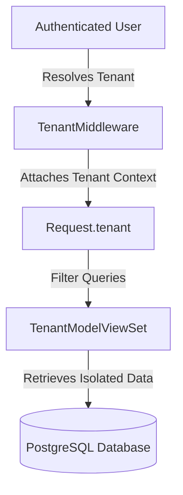

# EasyTrack - Multi-Tenant Medical Billing SaaS Architecture

EasyTrack is designed as a reusable Multi-Tenant Software-as-a-Service (SaaS) application for Medical Billing Workforce & Operations Management.

## Core Architectural Concepts



### 1. Multi-Tenancy Isolation
Every organization acts as an isolated tenant. Data isolation is enforced at the query level using `TenantModelViewSet`:
- `TenantModel` provides automatic fields `organization`, `created_at`, `updated_at`, `created_by`, and `updated_by`.
- `TenantModelViewSet` automatically filters all queries by the authenticated user's organization:
  ```python
  def get_queryset(self):
      return self.queryset.filter(organization=self.request.user.organization)
  ```
- This architecture guarantees that data from one organization is never visible to another, even if an ID is guessed.

### 2. Role-Based Access Control (RBAC)
Role capabilities are enforced using specialized Django REST Framework permission classes:
- `IsCEO`: Highest business visibility, payroll approvals, recruitment metrics, security configurations, and tenant-wide settings authorization.
- `IsOperationsHead`: Access to client portfolio, operational processes, SOP management, work allocations, tasks, billing metrics, SLA alerts, quality trends, workforce schedules, and workflow automations.
- `IsHR`: Full employee lifecycle tracking, talent acquisition/recruitment pipeline, onboarding clearance, offboarding clearance checklists, secure employee documents, attendance and shift/break policies, leave requests, payroll engine processing, HR helpdesk tickets, asset inventory, and performance review cycles.
- `IsTL`: Team workforce roster, team attendance logs, leave request reviews and approval recommendations, team tasks oversight, escalations management, team QA audit quality history, and team performance goal/KPI assessment.
- `IsEmployee`: Access to personal work queue, daily tasks, personal billing metrics log, check-in break/shift state machine, personal attendance, personal leave requests, self-assessments/performance goals, secure document upload, assigned assets list, personal HR request tickets, and announcements notice board.
- `IsQAEnabled`: Dynamic additional permission attached to employees with `qa_enabled = True` enabling access to the QA Workspace, auditing checklists, and error severity logging.

### 3. Messaging Privacy
Private chat messaging is fully private.
- The `ConversationViewSet` limits listings and access using the authenticated user object:
  ```python
  def get_queryset(self):
      return self.queryset.filter(participants=self.request.user)
  ```
- Management (CEO, HR, TL) cannot query or access private conversations they are not directly participating in.
- Audit logs record message creation metadata (actor, timestamp) but **never** record actual message content.

### 4. Technical / Development Guidelines
- **SQLite Fallback**: In development, if PostgreSQL environment settings are omitted, the application falls back gracefully to a local SQLite database for instant setup.
- **Passwords**: Raw passwords are never exposed in log output or stored in plaintext. Standard Django secure hashing (`pbkdf2_sha256`) is enforced.

### 5. Frozen EasyTrack Module Architecture
To prevent functional overlap and ensure strict role boundaries, the modular architecture of EasyTrack has been frozen and mapped to specific user roles as follows:

| System | Module / Portal | CEO | Operations Head | Team Lead (TL) | HR | Employee | QA | Django Admin |
|---|---|---|---|---|---|---|---|---|
| **HRMS** | Recruitment Pipeline | View | - | - | Manage | View | - | Manage |
| | Onboarding Clearance | View | - | - | Manage | View | - | Manage |
| | Employee Profiles | View | - | View | Manage | View | - | Manage |
| | Employee Lifecycle | View | - | - | Manage | View | - | Manage |
| | HR Helpdesk Tickets | - | - | - | Manage | Request | - | Manage |
| | Secure Documents | - | - | - | Manage | Upload | - | Manage |
| | Offboarding Clearance | View | - | Clear | Manage | View | - | Manage |
| | Asset Inventory | View | - | - | Manage | View | - | Manage |
| **OPERATIONS**| Client Portfolio | Manage| Manage | View | - | - | - | Manage |
| | Process Definitions | - | Manage | View | - | - | - | Manage |
| | Project Milestones | Manage| Manage | View | - | - | - | Manage |
| | Work Allocation | View | Manage | Manage | - | Execute | - | Manage |
| | Daily Tasks (Jira-style)| View | Manage | Manage | - | Execute | - | Manage |
| | Escalations & SLA | View | Manage | Manage | - | View | - | Manage |
| **FINANCE** | Payroll Engine | Approve| - | - | Process | View | - | Manage |
| | Compensation Rules | Manage| - | - | Manage | - | - | Manage |
| **QA SYSTEM** | QA Workspace | View | View | View | - | Rework | Audit | Manage |
| | Quality Trends | View | Manage | View | - | View | - | Manage |
| **KNOWLEDGE** | Client SOP & KB Docs | - | Manage | Manage | - | Read | - | Manage |
| **COMMUNICATION**| Private Chats | Participant| Participant| Participant| Participant| Participant| - | Audit Logs |
| | Announcements Board | Publish| Read | Read | Publish | Read | - | Manage |
| **ANALYTICS** | Executive Dashboard | View | - | - | - | - | - | Manage |
| | Operations Dashboard | - | View | - | - | - | - | Manage |
| | Team Dashboard | - | - | View | - | - | - | Manage |
